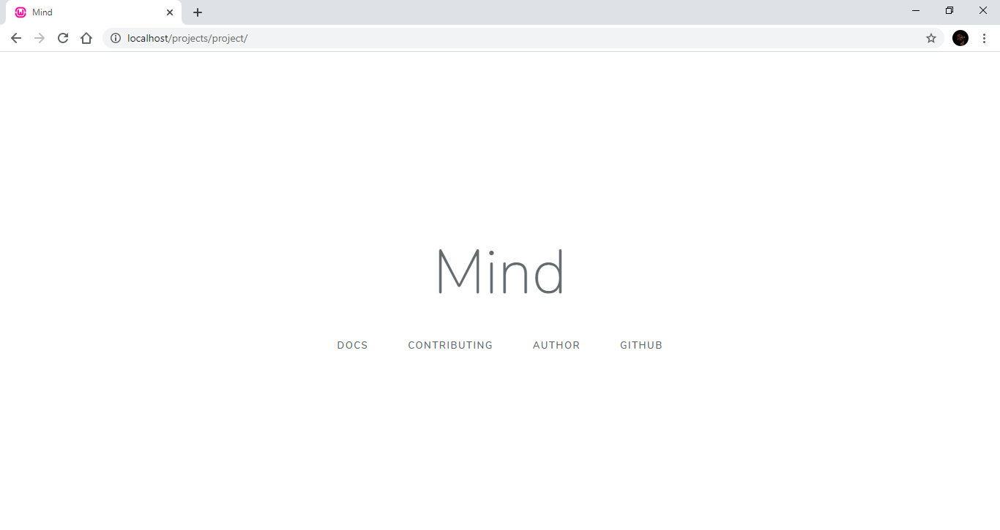

# project nedir?
Mind framework ile proje geliştirmeye hemen başlamanız için oluşturulmuş yalın proje örneğidir. 

## Nasıl edinilir?

[Burayı tıklayıp](https://github.com/aliyilmaz/project/archive/refs/heads/master.zip) projeyi indirebilirsiniz.

## Nasıl kurulur?
* Sunucunuza dosyaları ister bir klasör içinde olacak şekilde isterseniz de olduğu gibi çıkarın
* index.php dosyasında ki veritabanı bilgilerinizi güncelleyin.
* Artık internet tarayıcınızın adres satırından projeye erişebilirsiniz.

## Nasıl kullanılır?
Mind, rota adresine tanımlanan katmanların geliştirilmesinde kullanılır. Tüm katmanlar içinde Mind'ın bütün metotlarını `$this` ön eki yardımıyla kullanabilirsiniz.

---

Daha fazlası için, [Mind'ın dökümanını](https://github.com/aliyilmaz/Mind/blob/master/docs/tr-readme.md) inceleyebilirsiniz.

## Ekran görüntüleri

#### Anasayfa

#### Hata sayfası
